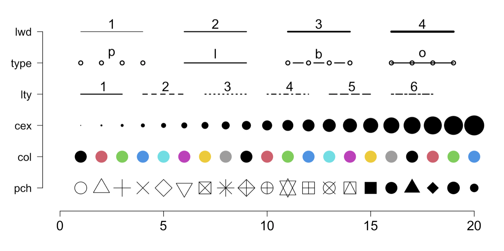

::: {.callout-important}
When you make a Markdown document that creates graphics, you want to make sure that you have set `self-contained: true` in the top YAML.  This embeds the images into the resulting single HTML file instead of making them adjacent to the HTML file.  This will **ensure** your document has the graphical output when you turn it in without needing to upload a zip archive.  
:::

## The Data

Let's start by playing around with some of the [Rice Rivers Center](https://ricerivers.vcu.edu) data.  Make sure that the file `get_rice_data.R` is in the same folder (and the folder of your course Project).  

The code in the next chunk will load in, and format, the Rice Data for us.  

```{r}
library( tidyverse )

# grab the code from inside that file
source( "get_rice_data.R" )

# use the function
get_rice_data() -> rice 

# take a look at it
summary( rice )
```


## Classic Graphics

The following basic graphs focus on the built-in `classic` plotting techniques.


*Univariate - Histograms*

Create a histogram of water temperature (displayed in @fig-waterHistogram).  Make the bars a nice shade of blue and create the labels on the axes that properly describe the data. 

I have added metadata to this chunck to show you how to make labels and captions so you can reference the figure in the text.  Do this for **all** the remaining plots in this activity.  

```{r}
#| label: fig-waterHistogram
#| fig-cap: "The distribution of water temperature measured at the Rice Rivers Center over the first months of 2014."

hist( rice$Water_Temperature, 
      main="", 
      col="lightblue" )

```


*Density Plots*

For the same data, create a *probability density plot* using the `density()` function.  

```{r}

```


### Bivariate


*Scatter Plots*

Filter the Rice Center data for samples during New Years Day in 2014.  Create a scatter plot of Wind Speed and Barametric Pressure, properly annotated and referenced in the text.  

```{r}

```

*Customization*

Here are some methods for customization of components in a classic graph.

Parameter | Description
----------|-----------------------------------------------------------------------------------------------------------
`type`    | The kind of plot to show ('p'oint, 'l'ine, 'b'oth, or 'o'ver).  A point plot is the default.
`pch`     | The character (or symbol) being used to plot.  There 26 recognized general characters to use for plotting.  The default is `pch=1`. 
`col`     | The color of the symbols/lines that are plot.
`cex`     | The magnification size of the character being plot.  The default is `cex=1` and deviation from that will increase (cex > 1) or decrease (0 < cex < 1) the scaling of the symbols.  Also works for `cex.lab` and `cex.axis`.
`lwd`     | The width of any lines in the plot.
`lty`     | The type of line to be plot (solid, dashed, etc.)
`bty`     | The 'Box' type around the plot ("o", "1", "7","c","u", "]", and my favorite "n")


Use the scatter plot above and customize the color and shape of the plots.  Annotate properly.

```{r}

```





*Color spaces*

Here are some external components related to colors and plotting:  

- Hex ([coolors](https://coolors.co/))
- Named (via `colors()`)  
- [ColorBrewer](https://colorbrewer2.org/)


Color brewer is a great resources you can use as necessary.

```{r}
library(RColorBrewer)
display.brewer.all()
```


*Boxplots*

Filter the Rice Center Data for samples in February.  Create a box plot by day of the week showing differences in Water Temperature.  Label the graph properly and create links and captions.  Write one or two sentences describing what this graph is telling us.

```{r}
rice |>
  filter( Month == "February" ) -> rce 
boxplot( Water_Temperature ~ Weekday, data = rce, notch = TRUE)
```


*Text Overlays*

Use the data from your scatter plot above.  Use the function `cor()` to determine the correlation between the parameters `Wind_Speed` and `Barametric_Pressure`.  Use `text()` to overlay the correlation on the graph.


```{r}

```


## GGPlot Graphics


### Univariate Data


*Histograms*

Create the same histogram as you did above.

```{r}

```


*Barplots*

Create the same barplot as you did above.

```{r}

```


### Bivariate Data

*Scatter Plots*

Create the same scatter plot with text overlay of the correlation as you did above.  Explore themes if you like.

```{r}

```


